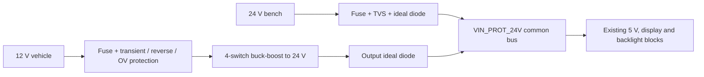

# ESP32-P4 Displayman Development Daughterboard — PRD & Schematic

## Phase 1 — Engineering Product Requirements & Design Specification

| Document status | Version / date | Phase |
|---|---|---|
| Engineering revision pending approval | v0.4 • 14 September 2026 | PRD and non-blocking Phase-2 preparation only |

<table>
<colgroup>
<col style="width: 100%" />
</colgroup>
<tbody>
<tr class="odd">
<td>
<strong>Design decision</strong>

The daughterboard is technically plausible. Displayman's 14 September 2026 response closes the IOVCC, VCI selection, power-sequence, backlight, source-mapping, touch-electrical, and panel-side FPC questions, but it leaves a mathematically inconsistent DSI transport specification. Schematic capture must not begin until the DSI rate/limit is corrected and the user approves this revision. This document intentionally does not provide a circuit schematic.
</td>
</tr>
</tbody>
</table>

**Target platform:** Waveshare ESP32-P4-NANO + Displayman KD068HDFID009-C009A

### Revision history

| Version | Date | Change |
|---|---|---|
| v0.1 | 13 September 2026 | Initial Phase 1 PRD approved and committed. |
| v0.2 | 13 September 2026 | Recorded Displayman engineering confirmation that the supplied two-lane initialization file, including `RSOX(600)`, is correct for the exact KD068HDFID009-C009A module; narrowed the remaining uncertainty to the 600-to-480 source mapping and unconfirmed DSI transport parameters. |
| v0.3 | 14 September 2026 | Incorporated Displayman's detailed engineering response: fixed 1.8 V IOVCC and 2.8 V VCI; recorded reset/shutdown timing, 16.8–19.8 V / 240 mA backlight limits, confirmed 600-to-480 host mapping, panel-side FPC orientation, and GT9271 INT type. Kept DSI open because the supplied rate is arithmetically impossible and recorded the non-blocking GT9271 address/source-range contradictions. Integrated the independently validated Phase 2 component/GPIO recommendations without beginning schematic capture. |
| v0.4 | 14 September 2026 | Added protected nominal-12 V vehicle evaluation input, four-switch buck-boost conversion to the common 24 V-class bus, dual-source reverse blocking, safe-by-default Nano 5 V eFuse behavior, representative current estimates, vehicle brownout/recovery requirements, and an expanded power-state validation matrix. Automotive qualification remains explicitly out of scope; UQ-02 remains the schematic-release blocker. |

## 1. Executive summary

This PRD defines a development/evaluation daughterboard that accepts either a regulated 24 V wall-adapter input or a protected nominal-12 V vehicle input, powers the Waveshare ESP32-P4-NANO and the Displayman LCD/touch module, adapts the Nano’s 15-pin two-lane MIPI-DSI interface to the panel’s 40-pin LCD FPC, controls the GT9271 touch controller, and supplies a 240 mA constant-current backlight channel with ESP32-P4 PWM dimming.

The recommended architecture uses separately protected and reverse-blocked 24 V bench and nominal-12 V vehicle branches feeding one common 24 V-class internal bus, a 5 V / 3 A system buck rail for the Nano and local regulators, fixed 1.8 V IOVCC, fixed 2.8 V VCI, hardware-enforced reset/shutdown behavior, a 24 V-fed constant-current buck LED driver, low-capacitance ESD protection, and deliberately accessible debug points. It is an evaluation design—not an automotive-qualified product.

<table>
<colgroup>
<col style="width: 100%" />
</colgroup>
<tbody>
<tr class="odd">
<td>
<strong>Resolved finding: IOVCC</strong>

Displayman engineering has explicitly approved and recommended 1.8 V nominal IOVCC for this exact module and identified the printed 1.68 V absolute maximum as a datasheet typo; its response states an approximate true absolute maximum of 3.6 V. The design shall therefore use a fixed 1.8 V rail. The response describes the normal 1.8 V operating band as 1.65–1.95 V while also mentioning a 3.3 V upper DC tolerance; this does not authorize a switchable 3.3 V implementation, which is no longer required.
</td>
</tr>
</tbody>
</table>

<table>
<colgroup>
<col style="width: 100%" />
</colgroup>
<tbody>
<tr class="odd">
<td>
<strong>Blocking finding: DSI rate / pixel format</strong>

Displayman now specifies RGB888, 600 × 1280 host active timing, 55 MHz, two lanes, continuous clock recommended, and an 80–500 Mb/s/lane D-PHY range, but also states that the required lane rate is 110 Mb/s/lane by multiplying 55 MHz by DDR. Those statements cannot all be true. At the derived 60.007 Hz frame rate, active RGB888 pixels alone require approximately 553 Mb/s/lane before packet overhead; a non-burst representation at the 55 MHz pixel clock requires 660 Mb/s/lane before overhead. Even the lower bound exceeds 500 Mb/s/lane, while 110 Mb/s/lane provides only 220 Mb/s aggregate. Displayman must provide the lane-bit-rate setting from a known-working host design and identify which stated parameter or limit is wrong. The PCB will be designed for at least 1.5 Gb/s/lane, consistent with the ESP32-P4 transmitter capability.
</td>
</tr>
</tbody>
</table>

### Review decision requested

- Approve the architecture and requirements as the basis for Phase 2, subject to the gates in Section 14.

- Obtain Displayman’s corrected DSI lane-rate/limit answer before schematic release.

- Confirm the daughterboard’s mechanical relationship to the Nano and desired cable lengths/contact orientation.

- Use fixed 1.8 V IOVCC; do not expose a 3.3 V selection.

### Phase boundary

STOP: Phase 2 schematic design has not started. Approval or requested modifications to this PRD are required first.

## 2. Scope, use case, and non-goals

### 2.1 Intended use

- Open-bench bring-up, firmware development, display characterization, touch integration, and thermal evaluation.

- Powered from a regulated, center-positive 24 V DC wall adapter through a PCB barrel jack, from a nominal-12 V vehicle supply through a separate keyed connector, or with both connected.

- One Waveshare ESP32-P4-NANO and one KD068HDFID009-C009A module per daughterboard.

- User-accessible connectors, jumpers, indicators, and test points suitable for repeated laboratory use.

### 2.2 In scope

- 15-pin Nano DSI/I²C adapter, 40-pin LCD connector, and 8-pin touch connector.

- Independent 24 V bench and nominal-12 V vehicle input protection, vehicle-to-24 V-class conversion, reverse-blocked source ORing, 5 V/3.3 V/1.8 V conversion, sequenced VCI/IOVCC/reset, and safe-by-default Nano power feed.

- 240 mA total constant-current backlight drive and PWM dimming.

- PCB signal-integrity, power-integrity, mechanical, thermal, test, and firmware-interface requirements.

### 2.3 Explicit non-goals

- Automotive qualification, a claim of ISO 7637-2/ISO 16750 compliance, comprehensive AEC-Q component coverage, functional safety, production EMC certification, or sealed-enclosure design. Vehicle-input evaluation and conservative transient protection are in scope, but qualification requires a defined harness/source impedance and laboratory validation.

- A replacement for the ESP32-P4-NANO; Wi-Fi/C6, audio, camera, Ethernet, USB, and battery functions are outside this daughterboard’s scope.

- Panel optical redesign, LED-string rebalance, display flex modification, or reverse engineering undocumented GC9703C behavior.

- Final schematic, PCB layout, Gerbers, BOM, or firmware driver in Phase 1.

### 2.4 Design life and environment

Prototype target: indoor laboratory and supervised in-vehicle evaluation, 0–50 °C ambient at board level, non-condensing, natural convection, and accessible service protection. Component ratings shall normally be −40–85 °C or wider so the board is not the immediate temperature limitation, but this does not qualify the assembly for automotive service.

## 3. Source basis and interpretation rules

Requirements are derived from the three supplied files, written manufacturer correspondence, and current manufacturer documentation. Supplied files are identified by SHA-256 so later revisions cannot be silently substituted.

| **ID** | **Source**                          | **Revision / identity**                                           | **Use and precedence**                                                                                               |
|--------|-------------------------------------|-------------------------------------------------------------------|----------------------------------------------------------------------------------------------------------------------|
| S1     | KD068HDFID009-C009A .pdf            | Displayman, v1.0, 2024-11-25 SHA-256 4c8394ac…03bcf               | Primary panel mechanical, pinout, electrical, MIPI, reset, power, touch, and backlight source.                       |
| S2     | KD068HDFID009 -2LANE .txt           | SHA-256 81ec9ab8…e6872c                                           | Primary project-specific two-lane timing and command sequence. Treated as configuration data, not compilable source. |
| S3     | ESP32-P4-NANO-schematic.pdf         | Waveshare schematic PDF created 2024-10-25 SHA-256 1e57b31f…10de1 | Primary Nano connector mapping, header power, and GPIO connectivity source.                                          |
| S4     | ESP32-P4 Series Datasheet v0.7      | Espressif, 2026-07-14                                             | Current SoC limits, GPIO/strapping information.                                                                      |
| S5     | ESP-IDF MIPI DSI LCD API            | Current online documentation checked 2026-09-13                   | DSI host configuration model, lane count/rate, DPI timing fields.                                                    |
| S6     | ESP32-P4 Hardware Design Guidelines | Current online documentation checked 2026-09-13                   | MIPI implementation guidance; Nano already implements the SoC-side D-PHY support circuitry.                          |
| S7     | Displayman email from Anson Ho      | Received 2026-09-13; reports confirmation from Displayman engineering | Confirms S2, including `RSOX(600)`, is correct for the exact KD068HDFID009-C009A module. Does not define the 600-to-480 source mapping or DSI transport parameters. |
| S8     | Displayman email from Anson Ho      | Received 2026-09-14; repository PDF SHA-256 `76a9e533…d4d`          | Detailed answers for IOVCC, sequencing, DSI, backlight, source mapping, FPCs, and touch. Direct confirmations are controlling where internally coherent; contradictions remain explicitly open. |

### 3.1 Interpretation rules

- A specific module pinout or operating limit in S1 overrides generic controller-family information.

- S2 overrides generic timing defaults only where it is internally coherent and electrically compatible with S1.

- A contradiction involving an absolute maximum is never resolved by assumption; it becomes a blocking manufacturer question.

- Derived engineering calculations and board constraints are labeled as such and are not represented as Displayman requirements.

- Current component status was checked against manufacturer pages and authorized-distributor listings on 2026-09-13; availability must be rechecked at procurement.

### 3.2 Source defects already identified

- S1 Section 3.1 is titled as a CTP pin description but contains the 40-pin LCM connector.

- S8 confirms that VDDI in the power-sequence section means connector pin 3 IOVCC.

- S2 includes tool-specific pseudo-functions and malformed lines such as a missing parenthesis in a write_command call; it shall be normalized into a reviewed firmware table rather than compiled verbatim.

- S8 supplies a 16.8–19.8 V backlight range at 240 mA total over temperature and confirms four parallel strings at 60 mA each.

- S8 confirms RGB888 and the S1 80–500 Mb/s/lane D-PHY range, but its proposed 110 Mb/s/lane rate cannot transport the stated timing. Active pixels alone require approximately 553 Mb/s/lane before overhead.

- S2's header says VCI = 3.3 V, whereas S8's later power-up instruction specifies VCI = 2.8 V. Both are inside S1's 2.5–3.3 V operating range; this revision adopts S8's explicit 2.8 V instruction and S1's 2.8 V typical value for the board supply.

- S8 says the preferred 7-bit touch address is 0x5D with INT high during reset; S1's timing diagrams assign INT high to 0x14 and INT low to 0x5D.

- S8 confirms that the driver masks 60 dummy host columns on each side, but its detailed source-channel ranges contain an arithmetic inconsistency: `S901–S1500` spans 600 source outputs, not the stated 180. This does not alter the confirmed host requirement of H-active = 600.

## 4. Confirmed display and touch requirements

| **Characteristic**  | **Required / observed value**                                                                                                             | **Basis**           |
|---------------------|-------------------------------------------------------------------------------------------------------------------------------------------|---------------------|
| Panel               | Displayman KD068HDFID009-C009A; 6.75 in IPS, normally black                                                                               | S1 pp. 3–5          |
| Physical glass      | 480 RGB × 1280 visible pixels                                                                                                             | S1; S2 comment      |
| Vendor source configuration | Host H-active = 600 × 1280 using `RSOX(600)`; driver masks 60 dummy columns at each side to drive the 480 × 1280 physical glass. The host must transport a 600-wide active line but need not force the discarded columns black. | S2; S7; S8          |
| Timing              | H: 600 configured source positions + 4 sync + 40 back porch + 40 front porch = 684 total; V: 1280 active + 4 sync + 20 back porch + 36 front porch = 1340 total | S2; S7; S8          |
| Pixel clock / frame | 55 MHz; derived 55,000,000 ÷ (684 × 1340) = 60.007 Hz                                                                                     | S2 + calculation    |
| Display controller  | GC9703C                                                                                                                                   | S1                  |
| MIPI interface      | Two data lanes + differential clock                                                                                                       | S1/S2/S3            |
| VCI                 | Fixed 2.8 V nominal per S8 and S1 typical. S2's older 3.3 V header value is within S1 limits but is not used for the board supply.               | S1 §5.2; S2; S8     |
| IOVCC               | Fixed 1.8 V nominal; explicitly approved by Displayman. S8 identifies S1's 1.68 V absolute maximum as a typo and states approximately 3.6 V. | S1 §§5.1–5.2; S2; S8 |
| LCD logic current   | 30 mA typical, 60 mA maximum (datasheet does not split rails)                                                                             | S1 §5.2             |
| Backlight           | 24 white LEDs arranged 6S4P; 240 mA total (60 mA/string); 16.8 V min, 19.2 V typ, 19.8 V max over temperature; constant-current drive | S1 §5.3; S8         |
| Touch controller    | Goodix GT9271; ten-point capacitive touch                                                                                                 | S1 §§2, 7           |
| Touch supply        | 3.3 V target; 2.66–3.47 V allowed; 13 mA typical active                                                                                   | S1 §7.1             |
| Touch bus           | I²C at up to 400 kHz; RESET active low; INT bidirectional during address selection, then open-drain active-low with 2–10 kΩ pull-up to the powered touch domain | S1 §§3.2, 7.2–7.3; S8 |
| Touch addresses     | 7-bit 0x5D or 0x14. S1 maps INT low during reset to 0x5D and INT high to 0x14; S8's opposite parenthetical is treated as a non-blocking contradiction pending sample test. | S1 §7.3; S8         |

### 4.1 DSI payload-rate calculation

S8 confirms RGB888, H-active = 600, two lanes, a 55 MHz timing clock, and a derived frame rate of 60.007 Hz. The absolute lower bound using only active pixels is:

`600 × 1280 × 60.007 × 24 ÷ 2 = 553.0 Mb/s/lane`

If the 55 MHz DPI pixel stream is transported continuously, the raw rate is:

`55 MHz × 24 ÷ 2 = 660 Mb/s/lane`

Packet overhead and the selected video mode add margin. S8's 110 Mb/s/lane figure incorrectly equates twice the 55 MHz clock with the required payload rate, and even its stated 500 Mb/s/lane maximum is below the active-only lower bound. The D-PHY clock lane frequency is not interchangeable with the DPI pixel clock. Phase 2 shall not choose `lane_bit_rate_mbps` until Displayman supplies the setting from a known-working two-lane host and reconciles the 500 Mb/s/lane ceiling.

### 4.2 Panel handling

- Do not connect or disconnect the LCD or touch flex while any board rail is powered.

- Use ESD-safe handling and add connector-area protection; the module connector fingers shall not be touched.

- Backlight current shall never exceed 240 mA in normal operation; firmware power-up default is 0% duty.

## 5. System architecture

The daughterboard is partitioned into five zones. This is the controlling Phase-2 architecture unless an approval-gate answer requires a change.

| **Zone**                   | **Inputs**                | **Function**                                                                                 | **Outputs**                                |
|----------------------------|---------------------------|----------------------------------------------------------------------------------------------|--------------------------------------------|
| A. Protected sources       | 24 V barrel + 12 V vehicle | Separate fuses, transient/reverse/OV protection, vehicle buck-boost, independent ideal-diode ORing | VIN_PROT_24V common bus |
| B. System power            | VIN_PROT_24V              | Existing 60 V synchronous buck; isolated local display regulators; reverse-blocked Nano feed | SYS_5V_3A, TOUCH_3V3, LCD_IOVCC_1V8 |
| C. Sequenced display logic | SYS_5V, LCD_PWR_EN        | Separately controlled VCI/IOVCC rails, reset wired-AND, early power-fail handling             | LCD_IOVCC, LCD_VCI, LCD_RESET_N, LCD_READY |
| D. Video and touch         | Nano DSI/I²C + control GPIOs | Lane-preserving adapter, ESD, four-conductor powered-off isolation, GT9271 reset/address/interrupt | 40-pin LCD FPC, 8-pin touch FPC        |
| E. Backlight               | VIN_PROT_24V, BL_PWM      | 65 V-class constant-current buck at 240 mA with disable/fault/current-test provisions         | LED_A, LED_K                               |

### 5.1 Physical integration assumption

The baseline is a stack-on daughterboard using the Nano’s two 2×13, 2.54 mm headers for 5 V, ground, and control GPIOs, plus a short 15-position FFC from the Nano DSI connector to the daughterboard. The panel then connects through separate 40-position LCD and 8-position touch FFCs. Board outline, standoff locations, cable exit direction, and keepouts remain provisional until the mechanical arrangement is approved.

### 5.2 Grounding

All daughterboard grounds share one low-impedance ground system. High-current LED and buck-converter return paths shall be confined locally and shall not cross the MIPI or touch reference paths. Connector ground pins shall connect directly into the continuous reference plane with nearby stitching vias.

## 6. Connector and signal assignments

### 6.1 Nano 15-pin DSI connector — source mapping

The following mapping is read directly from S3. Pin numbering and cable contact side must still be checked by continuity on the actual Nano before committing copper.

| **Nano pin** | **S3 net**          | **Daughterboard use**                                        |
|--------------|---------------------|--------------------------------------------------------------|
| 1            | DSI_D1_N            | Panel pin 11 MIPI_1N                                         |
| 2            | DSI_D1_P            | Panel pin 12 MIPI_1P                                         |
| 3            | GND                 | MIPI return / plane                                          |
| 4            | DSI_CLK_N           | Panel pin 14 MIPI_CLKN                                       |
| 5            | DSI_CLK_P           | Panel pin 15 MIPI_CLKP                                       |
| 6            | GND                 | MIPI return / plane                                          |
| 7            | DSI_D0_N            | Panel pin 8 MIPI_0N                                          |
| 8            | DSI_D0_P            | Panel pin 9 MIPI_0P                                          |
| 9            | GND                 | MIPI return / plane                                          |
| 10           | NC / unlabeled      | No connection; verify on hardware                            |
| 11           | ESP_I2C_SCL (GPIO8) | Touch I²C SCL through isolation/ESD                          |
| 12           | ESP_I2C_SDA (GPIO7) | Touch I²C SDA through isolation/ESD                          |
| 13           | GND                 | Logic return / plane                                         |
| 14           | ESP_3V3             | Nano-side logic reference only; do not parallel with TOUCH_3V3 |
| 15           | ESP_3V3             | Nano-side logic reference only; do not parallel with TOUCH_3V3 |

### 6.2 Proposed control GPIO allocation

| **Nano header** | **GPIO** | **Net**         | **Safe-state requirement**                                                           |
|-----------------|----------|-----------------|--------------------------------------------------------------------------------------|
| P1 pin 10       | GPIO4    | LCD_RESET_CMD_N | High impedance must leave panel reset asserted through hardware pull-down/wired-AND. |
| P1 pin 9        | GPIO5    | CTP_RESET_N     | High impedance must hold touch reset low until firmware takes control.               |
| P1 pin 14       | GPIO22   | CTP_INT         | Bidirectional: output during address select, input interrupt afterward.              |
| P1 pin 5        | GPIO23   | BL_PWM          | Default low; no backlight before display initialization.                             |
| P1 pin 11 or 13 | GPIO20 or GPIO21 | LCD_PWR_EN | Final choice after pinned BSP review; default low. Avoid GPIO24 because it is a default USB Serial/JTAG signal. |

These GPIOs are exposed on S3 and are not among ESP32-P4 strapping GPIO34–GPIO38 [S4]. The corrected P1 pin numbers above supersede the v0.2 labels. Phase 2 shall select GPIO20 or GPIO21 for `LCD_PWR_EN` after checking the pinned Nano BSP/application; GPIO24 shall remain available for its default USB Serial/JTAG function.

### 6.3 Panel 40-pin LCD connector

| **Pins** | **Panel signal**      | **Board disposition**                                             |
|----------|-----------------------|-------------------------------------------------------------------|
| 1        | NC                    | No connection                                                     |
| 2        | VCI                   | Sequenced fixed 2.8 V                                                |
| 3        | IOVCC                 | Fixed sequenced 1.8 V                                              |
| 4        | GND                   | Ground plane                                                      |
| 5        | RESET                 | 1.8 V-domain reset, active low, wired hardware/firmware control   |
| 6        | NC                    | No connection                                                     |
| 7        | GND                   | Ground plane                                                      |
| 8 / 9    | MIPI_0N / MIPI_0P     | Nano lane 0 N/P; no polarity swap                                 |
| 10       | GND                   | Ground plane                                                      |
| 11 / 12  | MIPI_1N / MIPI_1P     | Nano lane 1 N/P; no lane swap                                     |
| 13       | GND                   | Ground plane                                                      |
| 14 / 15  | MIPI_CLKN / MIPI_CLKP | Nano clock N/P                                                    |
| 16–22    | GND                   | Ground plane; connect all                                         |
| 23–24    | NC                    | No connection                                                     |
| 25       | GND                   | Ground plane                                                      |
| 26–29    | NC                    | No connection                                                     |
| 30       | GND                   | Ground plane                                                      |
| 31–32    | LED−                  | Tie together at connector; constant-current driver cathode output |
| 33–38    | NC                    | No connection                                                     |
| 39–40    | LED+                  | Tie together at connector; filtered protected 24 V anode feed     |

### 6.4 Panel 8-pin touch connector

| **Pin** | **Signal** | **Board disposition**                            |
|---------|------------|--------------------------------------------------|
| 1       | GND        | Ground                                           |
| 2       | NC         | No connection                                    |
| 3       | VDD        | Filtered TOUCH_3V3; local decoupling             |
| 4       | SCL        | I²C through powered-off-protected switch and ESD |
| 5       | SDA        | I²C through powered-off-protected switch and ESD |
| 6       | INT        | GPIO22 through switch; bidirectional during address select, then open-drain active-low; 2–10 kΩ touch-side pull-up |
| 7       | RST        | GPIO5 through switch plus hardware reset clamp; active low |
| 8       | GND        | Ground                                           |

## 7. Power architecture, source isolation, and sequencing

### 7.1 Mandatory power-behavior requirements

The following behaviors are requirements independent of the final controller implementation:

- Accept regulated 24 V bench power at 21.6–26.4 V and nominal-12 V vehicle power through separate connectors. Either source may be absent or present, and simultaneous connection is legal.

- Prevent DC or transition backfeed from the common internal bus into either source connector, from vehicle power into the bench input, from bench power into the vehicle converter, from Nano USB into daughterboard rails, and from daughterboard 5 V into USB VBUS.

- Treat Nano USB connection during 12 V or 24 V operation as normal. USB-only operation may power the Nano but shall leave the display, touch, backlight, and common high-voltage bus off.

- Force backlight off and panel reset asserted whenever the common bus, 5 V rail, or required display rails are invalid. Brownout or cranking may reboot the system, but shall not cause latch-up, rail overshoot, or an uncontrolled backlight pulse.

- Isolate every cross-domain signal so an independently powered Nano cannot phantom-power LCD or touch circuitry and an energized display/touch domain cannot power an unpowered Nano through GPIO, I²C, RESET, INT, or DSI-adjacent logic.

- Recover automatically and deterministically after a valid source returns. Recovery shall execute a complete rail/reset/init sequence; it shall not resume in the middle of panel initialization.

### 7.2 Preferred dual-input architecture

The common downstream rail retains the existing net name `VIN_PROT_24V`. The 24 V→5 V, LCD logic, touch, and backlight blocks continue to use it unchanged.

A non-inverting, synchronous four-switch buck-boost is preferred for the vehicle stage. A boost-only stage is not selected: its direct input-to-output path cannot regulate an input excursion above the target bus and complicates isolation during a fast surge or a 24 V misconnection. SEPIC/flyback alternatives add loss, magnetics stress, or unnecessary isolation. The preferred controller is `LM5176QPWPRQ1`, an ACTIVE AEC-Q100 4.2–55 V controller, sized with external 100 V MOSFETs for 30 W continuous output capability.

Each branch has independent reverse-current blocking. The bench `LM74700-Q1` ideal-diode stage remains. A second ideal-diode stage between the vehicle converter and `VIN_PROT_24V` prevents the common bus from driving the converter output. No current-sharing claim is made: when both sources are valid, the branch with the slightly higher delivered voltage supplies the load; both branches remain electrically safe.

### 7.3 Vehicle-input operating envelope and protection

| Condition | Required behavior |
|---|---|
| 9–18 V continuous at vehicle connector | Full-load regulation to nominal 24.0 V internal vehicle branch; verify thermals at 9 V and maximum system load. |
| Approximately 7–9 V during crank | Converter may drop out or current-limit. Use hysteretic UVLO, nominally about 8.0 V rising / 7.0 V falling, so it does not chatter. Reboot is acceptable. |
| Below UVLO, including deep crank | Vehicle converter off; backlight off; panel reset low; no excessive input current; automatic clean restart after the rising threshold and debounce delay. |
| Above the accepted charging range | Adjustable front-end OV cutoff, provisional 20 V rising, disconnects the converter. Exact divider values and hysteresis are Phase-2 calculations. |
| Positive/negative transients or reverse battery | Survive safely through fuse, bidirectional high-energy TVS, `LM74800-Q1` with back-to-back MOSFETs, input filter, and appropriately rated downstream parts. Qualification to a named ISO pulse is not claimed without a defined test plan. |
| Accidental 24 V on vehicle connector | Front-end OV cutoff shall reject the input without energizing the converter; survival must be verified at 26.4 V before vehicle use. |

Preferred branch order is keyed connector → 5 A time-delay/serviceable fuse → damped input filter → `SM8S24CA-Q` 24 V bidirectional high-energy TVS → `LM74800-Q1` common-source back-to-back 100 V N-MOSFET protection → `LM5176-Q1` converter → `LM74700-Q1` output ideal diode. TVS location and filter damping shall be finalized using the selected harness/source impedance so the protection FETs and controller stay within SOA and absolute maximum during clamping.

### 7.4 Rail requirements

| **Rail** | **Nominal / design target** | **Consumers** | **Requirement** |
|---|---|---|---|
| VIN_ADAPTER | 24 V nominal, ±10% | Bench branch | Center-positive 5.5 × 2.1/2.0 mm adapter interface, ≥2 A, regulated and safety-approved; final barrel dimensions verified physically. |
| VIN_VEHICLE | 12 V nominal | Vehicle branch | Keyed/latched 2-pin input rated ≥8 A; full operation 9–18 V; deep-crank reboot permitted. |
| VEH_24V | 24.0 V nominal, 30 W continuous design target | Vehicle source-OR input | Four-switch buck-boost output; independent OVP/current limit/PGOOD and output reverse blocking. |
| VIN_PROT_24V | 21.6–26.4 V allowed common bus | 5 V buck, LED driver | Source-ORed, reverse-blocked, surge-protected internal bus. Existing downstream architecture uses this rail. |
| SYS_5V_3A | 5.0 V, 3 A continuous target | Nano and local LDOs | Existing LM76003 architecture retained. Feed Nano through a true-reverse-blocking, current-limited eFuse; service jumper normally fitted. |
| TOUCH_3V3 | 3.3 V, ≥100 mA | Touch/isolation | Not tied to Nano ESP_3V3; switched, locally decoupled, and isolated when off. |
| LCD_IOVCC | 1.8 V, ≥100 mA | Panel pin 3 | Fixed Displayman-approved voltage; sequence first; controlled discharge. |
| LCD_VCI | 2.8 V, ≥100 mA | Panel pin 2 | Fixed; separately switched after IOVCC. |
| LED_CURRENT | 240 mA total, ±5% target | Panel LED pins | Constant current; default disabled; PWM controllable; no pulse above nominal setpoint. |

### 7.5 Complete-system vehicle load and current budget

The converter is sized for the whole system, not just the backlight. The conservative electrical ceiling is 15 W delivered by the 5 V rail plus 4.752 W LED output at the confirmed 19.8 V maximum, conversion losses, supervisors, and development margin. This yields approximately 22.2 W expected worst-case draw from `VIN_PROT_24V`; the vehicle converter is designed for 30 W continuous output.

| Vehicle voltage | Assumed vehicle-stage efficiency | Input current at 22.2 W bus load | Input current at 30 W design capacity |
|---:|---:|---:|---:|
| 9.0 V | 88% | 2.80 A | 3.79 A |
| 12.0 V | 90% | 2.06 A | 2.78 A |
| 14.4 V | 92% | 1.68 A | 2.26 A |
| 16.0 V | 92% | 1.51 A | 2.04 A |

These are design estimates, not measured consumption. At the provisional 8 V turn-on threshold, 30 W at 85% would require about 4.41 A; therefore a 5 A time-delay fuse, ≥8 A connector, low-resistance protection path, and approximately 5 A input current limit are appropriate starting points. Full-load operation below 9 V is not required.

### 7.6 Nano 5 V and USB coexistence

The former removable-jumper-only concept is superseded. `SYS_5V_3A` shall feed Nano P1 pins 2/4 through an always-active true-reverse-current-blocking eFuse, provisionally `TPS259470ARPWR`, with approximately 3.2 A current limit, controlled inrush, fault indication, and no dependence on firmware. This blocks Nano/USB-derived 5 V from entering `SYS_5V_3A`. The removable jumper remains a labeled service disconnect, not an operating-mode selector.

Blocking in the opposite direction—Nano `VCC_5V` toward laptop VBUS—depends on the Nano's onboard USB power-path MOSFET. S3 shows that MOSFET path, but Waveshare gives no explicit dual-source rating. Schematic release shall preserve the safe-by-default daughterboard eFuse implementation; prototype release additionally requires a four-quadrant backfeed test at the Nano USB connector. If the Nano path fails that test, the only robust fixes require access to USB VBUS ahead of the Nano path (board modification or a dedicated data-only/debug interface), because USB VBUS is not separately exposed on the Nano headers.

The Nano DSI connector's ESP_3V3 pins remain sense/reference inputs only and shall never be driven.

### 7.7 Required LCD power-up sequence

Hardware and firmware shall jointly implement the following conservative sequence. LM3880 remains a candidate, not a requirement; the final supervisor/sequencer topology must also complete a controlled shutdown from an isolated display hold-up node after removal or switchover of the active source.

| **Step** | **Action** | **Minimum / target delay** | **Enforcement** |
|---|---|---|---|
| 0 | Keep LCD_IOVCC, LCD_VCI, LCD_RESET_N, and backlight off | Until common bus and required local rails are valid | Pull-downs + sequencer + firmware defaults |
| 1 | Enable LCD_IOVCC (1.8 V) | After maintained supply is valid | Hardware |
| 2 | Enable LCD_VCI at 2.8 V | 10 ms after IOVCC, conservative target | Hardware |
| 3 | Keep reset low after both rails stabilize | ≥5 ms; rail rise times ≥10 µs | Hardware reset clamp |
| 4 | Release panel reset after ≥10 ms low | S8 minimum 50 µs; S2 uses 10 ms | Hardware + GPIO4 open-drain command |
| 5 | Send reviewed GC9703C init table | ≥10 ms after reset release | Firmware |
| 6 | Sleep Out 0x11, wait ≥120 ms, Display On 0x29 | S2/S8 | Firmware |
| 7 | Enable PWM from 0% and ramp | After valid frames/display-on | Firmware |

### 7.8 Shutdown, hard-unplug, and source-transition behavior

- Normal shutdown: PWM = 0; send 0x28 then 0x10; wait ≥120 ms; assert reset; deassert LCD power.

- Hardware reverse sequence asserts reset first, disables VCI at least 10 ms later, then disables IOVCC at least 10 ms after VCI.

- Early-fail detection shall monitor the common bus and both branch PGOOD signals. A source handover that keeps `VIN_PROT_24V` above its valid threshold may continue without reset; any threshold crossing forces a full shutdown and later full reinitialization.

- The display hold-up node excludes Nano and backlight. Final capacitance, isolation, discharge, and supervisor thresholds shall guarantee reset assertion and ordered rail removal even when firmware is unavailable.

- Vehicle UVLO/OVLO, bench removal, USB insertion/removal, or a branch fault shall never bypass the hardware backlight disable. Firmware may only enable backlight when bus-valid, display-rail-valid, reset-released, and initialization-complete are all true.

## 8. MIPI-DSI electrical and PCB requirements

### 8.1 Logical routing

- Maintain lane identity and polarity end-to-end: D0N→MIPI_0N, D0P→MIPI_0P, D1N→MIPI_1N, D1P→MIPI_1P, CLKN→MIPI_CLKN, CLKP→MIPI_CLKP.

- No lane swap, P/N swap, branch, test pad, probe stub, common-mode choke, or AC-coupling capacitor may be introduced without an explicit signal-integrity review.

- Provide optional 0201/0402 series-resistor locations in-line near the Nano-side connector, initially populated 0 Ω, consistent with Espressif’s hardware guidance. Pads shall be optimized to minimize discontinuity.

- Place TPD6E05U06RVZR six-channel 0.5 pF ESD protection adjacent to the panel-facing connector with flow-through routing and minimal ground inductance.

### 8.2 Controlled-impedance constraints

| **Constraint**         | **PRD target**                                                                                                       | **Acceptance evidence**                                        |
|------------------------|----------------------------------------------------------------------------------------------------------------------|----------------------------------------------------------------|
| Differential impedance | 100 Ω nominal; fabrication tolerance ±10% or tighter                                                                 | Stack-up and field-solver coupon from PCB fabricator           |
| Single-ended reference | 50 Ω nominal for each conductor                                                                                      | Same calculation as above                                      |
| Intra-pair mismatch    | ≤0.15 mm target; ≤0.25 mm absolute on daughterboard                                                                  | KiCad length report                                            |
| Pair-to-pair skew      | Keep CLK, D0, and D1 routed to similar electrical length; ≤5 mm board-only spread target                             | KiCad length report                                            |
| Reference              | Continuous adjacent ground plane; no split/void under traces, pads, or vias                                          | Layout inspection / plane plot                                 |
| Vias                   | Avoid where possible; if required, use the same count and geometry in both legs; target ≤2 signal vias per conductor | Layout inspection                                              |
| Spacing                | At least 3× local trace width to unrelated high-speed nets; maximize spacing from buck/LED switch nodes              | DRC rule + inspection                                          |
| Cable + board channel  | Validate at confirmed operating lane rate; board designed with margin to 1.5 Gb/s per lane                           | Display stress patterns; optional TDR/eye testing if available |

### 8.3 Placement and stack-up

- Minimum four-layer board: L1 signals/components, L2 uninterrupted ground, L3 power/low-speed, L4 signals/components. A six-layer stack may be used if it materially improves uninterrupted routing.

- Place Nano DSI and panel LCD connectors so the three differential pairs form the shortest practical direct corridor.

- Keep the 24 V buck, LED driver, inductors, diodes, switch nodes, and hot-loop copper in a physically separate power zone; no DSI trace may enter or cross that zone.

- Ground stitching shall flank connector transitions and provide a short return for ESD arrays. No high-speed trace shall cross a ground-plane slot created by connector mounting pads.

### 8.4 DSI configuration acceptance

The final ESP-IDF settings shall record: two lanes, confirmed lane bit rate, pixel-clock source, RGB pixel format, video/burst mode, horizontal and vertical timing, and any continuous-clock requirement. The design is not accepted solely because a static image appears; it must pass color bars, checkerboard, moving gradients, all-white/all-black, and at least a two-hour error-free run across the intended brightness range.

## 9. GT9271 touch requirements

### 9.1 Electrical interface

- Power the module touch VDD from TOUCH_3V3. Do not assume a separately accessible VDDIO; the 8-pin interface exposes only VDD.

- Use all four channels of TMUX1574DYYR between the Nano and touch domains for SCL, SDA, INT, and RESET. Power it from TOUCH_3V3 and enable it only when hardware confirms both domains valid. Translation is not required because both sides are nominally 3.3 V; powered-off isolation is the purpose.

- Provide the S8-required 2–10 kΩ INT pull-up on the touch side. Size any I²C pull-ups only after accounting for the Nano's documented 2.2 kΩ pull-ups, module pull-ups, cable capacitance, and measured rise time; do not automatically parallel another strong Nano-side pair.

- Protect SCL, SDA, INT, and RST at the external touch connector with TPD4E05U06DQAR. ESD placement takes precedence over convenient probing.

- CTP_INT must be a bidirectional GPIO: driven during address selection and reconfigured as interrupt input afterward.

### 9.2 Default address and reset sequence

Default provisionally to the 7-bit address 0x5D using INT low during reset, as shown by S1's `0xBA/0xBB` timing diagram. Firmware shall assert RESET low for at least 100 µs after touch power is valid, drive INT to the address-select state, release RESET, wait more than 5 ms, then wait at least 50 ms before releasing INT and reconfiguring it as an input. Retain the 0x14 procedure using INT high. S8's statement that 0x5D uses INT high contradicts S1 and shall be checked on the real module; the hardware supports either selection.

### 9.3 Firmware behavior

- Probe the selected address after its complete reset sequence. If identification fails, execute the alternate address sequence once and log which address responds; do not merely probe the other address without re-strapping INT and resetting.

- Do not interpret the listed 0xBA/0xBB or 0x28/0x29 values as 7-bit Linux/ESP-IDF addresses; they are 8-bit read/write address bytes.

- Log reset cause, selected address, controller/product ID, firmware version if available, touch count, and interrupt activity for bench diagnosis.

- Expose a touch-reset pushbutton or clearly labeled test pad without allowing it to force an illegal LCD power state.

## 10. Backlight requirements

### 10.1 Driver architecture

Use TI TPS922053DYYR, a current-production 4.5–65 V non-synchronous buck LED driver with an integrated 150 mΩ switch, external differential current sense, spread spectrum, fault output, and fast PWM/hybrid dimming. Feed panel LED+ from filtered VIN_PROT_24V and regulate the single 240 mA total return at panel LED−. A nominal 200 mV sense threshold gives an initial `R_SENSE = 0.200 / 0.240 = 0.833 Ω`; use a low-temperature-coefficient precision resistor and complete the tolerance, pulse, and thermal calculation in Phase 2.

<table>
<colgroup>
<col style="width: 100%" />
</colgroup>
<tbody>
<tr class="odd">
<td>
<strong>Headroom condition</strong>

S8 confirms 19.8 V maximum LED forward voltage at 240 mA over temperature. Against the 21.6 V minimum adapter this leaves 1.8 V gross headroom before the input path, switch, diode, sense resistor, inductor, ripple, and tolerance losses. TPS922053's 100 ns minimum off-time gives an ideal duty ceiling of 98% at 200 kHz or 97% at 300 kHz, so the buck approach is viable when combined with the low-loss ideal-diode input. Phase 2 shall select approximately 200–300 kHz and prove the completed worst-case voltage budget. Retain LT8391A-class four-switch buck-boost as a contingency only if that calculation or dummy-load test fails.
</td>
</tr>
</tbody>
</table>

### 10.2 Brightness control

- BL_PWM is active high and defaults low by hardware pull-down. No floating input may turn on the backlight.

- Initial firmware target is 20 kHz PWM. TPS922053 specifies fast dimming and a 2,000:1 hybrid-dimming example at 20 kHz; final mode and frequency remain subject to measured low-duty linearity, flicker, audible behavior, and camera interaction.

- Firmware shall clamp command range to 0–100%, start at 0%, and ramp after display-on. It shall never use current overdrive to obtain brightness.

- Provide a hardware backlight-disable jumper and an easily measured DIM/enable test point.

### 10.3 Current, protection, and validation

- Current regulation target: 240 mA ±5% at 100% PWM after component tolerances; never exceed 252 mA during normal tests.

- Provide nonintrusive current-measure access (zero-ohm link or dedicated sense loop) on the LED return; ordinary meter insertion shall not expose the panel to an open-load transient.

- Validate open-load, connector removal while disabled, shorted output, brownout, PWM = 0/100%, and repeated enable/disable behavior. Hot-plugging while enabled is prohibited.

- Thermal test at 24 V, 240 mA, 100% duty for at least one hour in still air; no component may exceed its derated junction/case target or discolor the PCB.

### 10.4 Parallel-string limitation

The module internally parallels four six-LED strings. S8 confirms that the daughterboard shall regulate one 240 mA total current, nominally 60 mA per internal string. The daughterboard cannot observe individual string current sharing, so sample testing shall still check temperature and luminance uniformity.

## 11. Protection, filtering, debug, and PCB implementation

### 11.1 Protection and filtering

- Bench input: 2 A fuse, LM74700-Q1 ideal-diode controller with a suitably rated N-MOSFET, SMBJ30A TVS, and bulk + ceramic capacitors. This branch retains the v0.3 architecture and blocks current toward the barrel connector.

- Vehicle input: keyed ≥8 A connector, 5 A time-delay fuse, damped input filter, SM8S24CA-Q bidirectional high-energy TVS, LM74800-Q1 with back-to-back 100 V N-MOSFETs, and adjustable UVLO/OV cutoff. A separate output ideal diode prevents the common bus from driving the disabled converter.

- Common bus: both source branches must be reverse-blocking under steady state, hot-plug, brownout, and fault conditions. Bulk capacitance shall not defeat branch isolation or exceed connector/fuse inrush limits.

- Regulators and LED driver: local bypassing, short hot loops, exposed-pad thermal via arrays where required, and manufacturer-recommended input/output capacitor types and values.

- Panel logic rails: ferrite-bead option and local high-frequency/bulk decoupling adjacent to connector power pins; populated configuration based on stability and noise analysis.

- No TVS device substitutes may have materially higher capacitance on MIPI lanes without signal-integrity approval.

### 11.2 Required test points

| **Group**  | **Required labeled points**                                                                          |
|------------|------------------------------------------------------------------------------------------------------|
| Power      | BENCH_24V_RAW, VEH_12V_RAW, VEH_PROT, VEH_24V, VIN_PROT_24V, SYS_5V, NANO_5V, TOUCH_3V3, LCD_IOVCC, LCD_VCI, GND near every group |
| Sequencing | VIN_GOOD, LCD_PWR_EN, SEQ_FLAG1, SEQ_FLAG2, SEQ_FLAG3/LCD_READY, LCD_RESET_N                         |
| Touch      | CTP_SCL, CTP_SDA, CTP_RESET_N, CTP_INT, CTP_3V3                                                      |
| Backlight  | BL_PWM, BL_DIM, LED_A, LED_K, LED current measurement link                                           |
| MIPI       | No ordinary probe pads. Use connector breakout or a purpose-designed high-bandwidth interposer only. |

### 11.3 Development controls

- Nano 5 V service-isolation jumper/link, normally fitted; TPS259470A true-reverse-blocking eFuse remains the default protection and operating control.

- LCD power-enable override with OFF / MCU control positions; no forced-ON position that bypasses reset sequencing.

- Backlight hardware disable and current-set access.

- Reset pushbuttons or pads for LCD and touch, electrically combined with hardware sequencing so pressing a button cannot back-power an unpowered rail.

- Power-good LEDs for 24 V and 5 V, plus low-current indicators for sequenced rails where loading is acceptable. LEDs must not be the only indication of a safe state.

### 11.4 PCB and assembly

- Fabrication: controlled-impedance four-layer minimum, IPC Class 2 prototype workmanship target, ENIG or equivalent fine-pitch-compatible finish, and solder mask dams where fabricator rules permit.

- Separate noisy power and quiet display-interface placement zones; use thermal copper and via arrays per IC datasheets.

- Clearly mark pin 1, cable contact side, both input polarities and voltage ranges, LED hazard, connector reference, rail voltage, jumper default, fuse rating, and board revision on silkscreen.

- Place and space the vehicle transient clamp, protection FETs, converter hot loops, and common bus for their calculated peak voltage/current and heat flow. The board is neither mains circuitry nor an automotive-qualified ECU.

- Use keyed/retained connectors where possible; FFC latches must remain reachable with the Nano installed.

### 11.5 KiCad readiness

Phase 2 shall use hierarchical schematic sheets for Bench Input, Vehicle Input & Buck-Boost, Source ORing, 5 V Power, Display Rails & Sequencing, MIPI Adapter, Touch, Backlight, and Headers/Test. Net names in this PRD shall be retained. Every selected symbol/footprint must be checked against the manufacturer drawing, with pin numbers verified independently before PCB capture.

## 12. Selected components and rationale

These are the preferred Phase-2 design anchors. Supporting inductors, power resistors, capacitors, ferrites, and divider values are intentionally deferred until schematic calculations and manufacturer answers are complete.

| **Function**          | **Preferred manufacturer part number**          | **Key suitability**                                                 | **Status / rationale**                                                             |
|-----------------------|-------------------------------------------------|---------------------------------------------------------------------|------------------------------------------------------------------------------------|
| Vehicle connector     | Molex 43045-0200 header + 43025-0200 housing | Keyed/latching 2-position Micro-Fit 3.0; 8.5 A/contact, −40 to 105 °C header rating | Provisional mechanical selection for evaluation harness; mating terminals and wire gauge selected for ≥5 A. |
| Vehicle fuse          | 5 A time-delay/serviceable fuse, exact holder pending | Coordinates with 30 W stage and ~4.4 A current at 8 V threshold | Requirement fixed; exact fuse/holder remains a mechanical implementation choice after inrush simulation. |
| Vehicle TVS           | Bourns SM8S24CA-Q | 24 V standoff, 38.9 V clamp class, 6.6 kW bidirectional, AEC-Q101 | Preferred high-energy clamp; large DO-218 footprint and pulse/fuse coordination must be validated. |
| Vehicle protection    | TI LM74800QDRRRQ1 + two CSD19531Q5A | 3–65 V controller, reverse input to −65 V, reverse-current and adjustable OV protection; 100 V/6.4 mΩ FETs | ACTIVE controller/FETs; common-source back-to-back arrangement preferred. Final SOA/dVdt calculations required. |
| Vehicle buck-boost    | TI LM5176QPWPRQ1 + four CSD19531Q5A | 4.2–55 V synchronous four-switch controller; 24 V/30 W target; 100 V external FETs | ACTIVE/AEC-Q100 controller. Simpler than newer I²C-heavy LM51772-Q1 and adequate for fixed output; magnetics/compensation final in Phase 2. |
| Vehicle inductor      | Coilcraft XAL7030-682MEC class | 6.8 µH, 15 A typical saturation, 6.8 A 40 °C-rise Irms, shielded, AEC-Q200 | Provisional calculation anchor only; final L/value/package follows LM5176 loss and ripple design. |
| Vehicle-output ORing  | TI LM74700-Q1 + CSD19531Q5A | Reverse-current block between VEH_24V and common bus | Independent of converter enable state; prevents bench-source backfeed. |
| Nano 5 V eFuse        | TI TPS259470ARPWR | 2.7–23 V, 5.5 A, 28 mΩ typical, true reverse-current blocking, adjustable current/UV/OV and inrush | Replaces jumper-as-procedure approach; auto-retry variant with ~3.2 A limit is provisional. Service jumper retained. |
| 24 V barrel jack      | Switchcraft RAPC722X                            | Right-angle through-hole, 24 V / 5 A, common 5.5 mm barrel family   | Preferred replacement for mismatched PJ-044AH; verify actual adapter inner/outer dimensions before footprint freeze. |
| Input fuse            | Littelfuse 0451002.MRL                          | 2 A, 125 V, surface-mount fuse                                      | Selected; voltage margin above 24 V. I²t to be checked against measured inrush.    |
| Reverse protection    | TI LM74700-Q1 + external ≥60 V N-MOSFET        | 3.2–65 V ideal-diode controller; reverse-current blocking           | Preferred over series Schottky to preserve LED-driver headroom; MOSFET selected during Phase 2 calculation. |
| Input TVS             | Littelfuse SMBJ30A                              | 30 V standoff, ≈48.4 V clamp class, 600 W                           | Selected for adapter-cable transients while remaining below 60/65 V IC ratings.    |
| 24 V → 5 V buck       | Texas Instruments LM76003RNPR                   | 3.5–60 V, 3.5 A synchronous buck                                    | Active; adequate 5 V / 3 A target with protection and PGOOD.                       |
| Touch 3.3 V LDO       | Texas Instruments TLV75533PDBVR                 | 500 mA, enable, low-noise/low-IQ LDO                                | Active; ample touch/support current and margin; switched domain isolated from Nano. |
| IOVCC 1.8 V LDO       | Texas Instruments TLV75518PDBVR                 | 500 mA, enable, fixed 1.8 V                                         | Active; default IOVCC source, sequencer controlled.                                |
| VCI source            | Texas Instruments TLV75528PDBVR                | Fixed 2.8 V, 500 mA LDO                                             | Selected from S8's explicit instruction and S1's typical value.                     |
| VCI load switch       | Texas Instruments TPS22919DCKR                  | 1.6–5.5 V, 1.5 A, controlled rise, quick discharge                  | Active family; provides controlled 2.8 V VCI ramp and turn-off discharge.           |
| Rail sequencer        | LM3880MF-1AA/NOPB or discrete supervisor/logic  | Hardware-controlled flags with reverse shutdown capability          | Implementation choice; must meet S8 timing and complete shutdown from isolated hold-up after hard unplug. |
| Power-fail supervisor | Texas Instruments TPS3808G01DBVR                | Adjustable 0.405 V sense, open-drain reset, programmable delay      | Selected to initiate early controlled shutdown; divider/hold-up values in Phase 2. |
| LCD reset buffer      | Texas Instruments SN74LVC1G07DBVR               | Open-drain non-inverting buffer with partial-power-down support     | Selected for wired-AND reset control and 1.8 V pull-up domain.                     |
| Touch-domain isolation | Texas Instruments TMUX1574DYYR                 | Four powered-off-protected bidirectional channels, fail-safe control | Preferred for SCL/SDA/INT/RESET; enabled only when both 3.3 V domains are valid.   |
| MIPI ESD              | Texas Instruments TPD6E05U06RVZR                | Six channels, ~0.5 pF, 5.5 V, up to 6 Gb/s class                    | Active; one part protects D0/D1/CLK conductors with low loading.                   |
| Touch ESD             | Texas Instruments TPD4E05U06DQAR                | Four channels, ~0.5 pF, IEC ESD protection                          | Active; covers SCL/SDA/INT/RST.                                                    |
| Backlight driver      | Texas Instruments TPS922053DYYR                 | 4.5–65 V, 150 mΩ integrated switch, external sense, fault output, fast PWM/hybrid dimming | Preferred for confirmed 16.8–19.8 V / 240 mA load; final 200–300 kHz design must prove worst-case headroom. |
| Nano DSI connector    | Amphenol SFW15R-2STE1LF                         | 15-position, 1.00 mm, top-contact ZIF; active/in stock              | Provisional; cable type/contact side must mate the Nano’s actual connector.        |
| Panel LCD connector   | Molex 505110-4096                               | 40-position, 0.50 mm, bottom-contact FD19                           | Selected by S1 and consistent with S8's bottom-contact requirement; physical flex presentation still requires inspection. |
| Panel LCD FFC         | Molex 0150200429 (76 mm) or 0150200431 (102 mm) | 40-way, 0.50 mm Premo-Flex class                                    | Provisional length/contact orientation; choose after mechanical mock-up.           |
| Touch connector       | Hirose FH12-8S-0.5SH(55)                        | 8-position, 0.50 mm, bottom-contact ZIF                             | Electrically consistent with S8; insertion direction and flex presentation still require sample inspection. |
| Stacking sockets      | Samtec SSW-113-02-G-D (two)                     | 2×13, 2.54 mm female socket                                         | Provisional; stack height and Nano header geometry require confirmation.           |

### 12.1 Component selection policy

- Use exact orderable MPNs; no generic ‘or equivalent’ substitutions on regulators, sequencer, reset buffer, ESD arrays, connectors, or LED driver without review.

- All power magnetics and capacitors shall be selected from the IC manufacturer’s calculation and stability requirements, derated for DC bias, ripple current, saturation, temperature, and tolerance.

- Prototype alternates may be added as DNP footprints only when they do not create stubs on MIPI paths or undermine sequencing.

- Procurement shall recheck lifecycle and stock immediately before schematic freeze and again before assembly release.

## 13. Firmware and bring-up requirements

### 13.1 Firmware responsibilities

- Initialize GPIO safe states before enabling the LCD sequence: LCD_PWR_EN = 0, LCD reset asserted, touch reset asserted, BL_PWM = 0.

- Configure the ESP-IDF MIPI DSI bus for two lanes, RGB888, continuous clock unless testing proves otherwise, and the final corrected lane bit rate; configure H-active = 600 and the S2 porches/timing. Do not use S8's uncorrected 110 Mb/s/lane value.

- Translate S2 into a typed, bounds-checked command table with explicit command length and millisecond delays. Preserve byte order and document every normalized syntax repair.

- Execute panel reset and initialization only after LCD_READY; maintain the 120 ms delays after reset release and Sleep Out as supplied.

- Preserve `RSOX(600)` and configure a 600-pixel-wide transport canvas. S8 confirms that the controller masks/discards 60 host columns at each side to produce the 480-pixel visible image; the discarded values need not be explicitly black. Map the intended 480-pixel application image into the center of the 600-wide transport buffer and clear the ignored columns deterministically during bring-up. Validate with numbered columns, edge markers, and color bars before relying on the crop.

- Initialize GT9271 with the documented reset/INT address selection; configure I²C at no more than 400 kHz.

- Enable backlight only after stable video, starting at zero duty; provide a diagnostic command to set duty, force display reset, read touch ID, and report rail/power-good states.

### 13.2 Initialization-file acceptance

The complete S2 byte sequence remains the authoritative starting point and shall be version-controlled by its SHA-256. S7 confirms that Displayman engineering considers this initialization file correct for the exact module, and S8 explains the host-visible 600-to-480 crop. `RSOX(600)` shall be preserved. Phase 2/firmware implementation shall produce a machine-readable diff or review report showing that every command byte and delay is represented. Apparent wrapper-syntax errors shall be corrected only at the wrapper level; command payloads shall not be edited without documented evidence. S8 does not resolve the wrapper-syntax artifacts and gives an unusable DSI lane-rate value, so those items remain open.

### 13.3 Failure behavior

- On init failure, hold backlight off, report an error, and avoid repeated rapid power cycling.

- On touch failure, the display may continue while logging the detected address/reset state.

- On power-good loss, immediately set PWM low and deassert LCD_PWR_EN; hardware must complete the safe sequence even if firmware stalls.

- Watchdog/reset events shall restore safe GPIO defaults before panel rails or backlight can re-enable.

## 14. Unresolved questions, conflicts, and assumptions

<table>
<colgroup>
<col style="width: 100%" />
</colgroup>
<tbody>
<tr class="odd">
<td>
<strong>Approval gate</strong>

Items marked BLOCKING must be closed before schematic release. Manufacturer confirmation means written confirmation tied to the exact KD068HDFID009-C009A module revision, not an inference from a similar panel or a generic GC9703C datasheet.
</td>
</tr>
</tbody>
</table>

| **ID / severity** | **Question or conflict**                                                                                                  | **Current evidence**                                                                                                       | **Proposed disposition / owner**                                                                                          |
|-------------------|---------------------------------------------------------------------------------------------------------------------------|----------------------------------------------------------------------------------------------------------------------------|---------------------------------------------------------------------------------------------------------------------------|
| UQ-01 CLOSED      | What is the correct IOVCC absolute-maximum rating, and is 1.8 V nominal explicitly approved?                              | S8 explicitly approves/recommends 1.8 V and identifies S1's 1.68 V absolute maximum as a typo; stated true limit is approximately 3.6 V. | Use fixed 1.8 V; do not implement user-selectable 3.3 V IOVCC. Record S8 as the controlled correction until a revised datasheet exists. |
| UQ-02 BLOCKING    | What lane bit rate is required for RGB888, 600 × 1280 H-active, 55 MHz timing over two lanes, and what is the true D-PHY maximum? | S8 says RGB888, 110 Mb/s/lane, and 80–500 Mb/s/lane. Active-only math requires ≈553 Mb/s/lane before overhead; continuous pixel transport requires 660 Mb/s/lane before overhead. | Displayman must provide the `lane_bit_rate_mbps` or equivalent from a known-working host and identify which rate/clock/limit is wrong. Do not use 110 Mb/s/lane. |
| UQ-03 CLOSED      | What are LED-string VF min/max over current and temperature, and required driver headroom?                                | S8 gives 16.8 V minimum, 19.2 V typical, and 19.8 V maximum at 240 mA over temperature.                                  | Use TPS922053 buck with ideal-diode input and approximately 200–300 kHz target; prove the final 21.6 V worst-case loss budget and retain buck-boost only as contingency. |
| UQ-04 CLOSED      | What VCI voltage and reset/rail ordering apply?                                                                              | S8 confirms VDDI = IOVCC, specifies 1.8 V IOVCC and 2.8 V VCI, reset low through ramp, ≥5 ms rail-stable delay, ≥50 µs reset pulse, and ≥120 ms normal shutdown wait. S1 permits 2.8 V VCI and shows conservative rail ordering. | Use 2.8 V VCI and conservative IOVCC→VCI→reset power-up, reset→VCI→IOVCC power-down, early fail detection, and isolated hold-up. The older S2 3.3 V header value is documented but does not block this safe implementation. |
| UQ-05 HIGH        | What are the LCD and touch cable contact-side/orientation requirements at both ends?                                      | S8 confirms bottom-contact 40-pin and 8-pin module-side connections. Nano connector MPN/contact presentation remains undocumented. | Panel-side electrical requirement is closed. Continuity-test the actual Nano and inspect both physical flexes before footprint/placement freeze. |
| UQ-06 HIGH        | Is Nano J1 pin 10 intentionally NC, and are pins 14/15 safe reference-only 3.3 V outputs?                                 | S3 shows pin 10 unlabeled; 14/15 tied to ESP_3V3.                                                                          | Verify with Waveshare and a powered-off continuity check. Do not drive ESP_3V3.                                           |
| UQ-07 HIGH        | What is the maximum sustained and transient 5 V current of the exact Nano build?                                          | S3 shows 5 V input and onboard conversion but no board-level input-current rating.                                         | Allocate 3 A; measure boot, CPU/PSRAM load, C6 activity, USB, and peripherals before final fuse/thermal sizing.           |
| UQ-08 NARROWED/HIGH | Does the Nano onboard USB-to-VCC_5V MOSFET guarantee zero reverse current from the externally driven 5 V header to laptop VBUS over all power transitions? | S3 shows a MOSFET power path but Waveshare provides no explicit dual-source guarantee; USB VBUS is not separately exposed at the headers. | Concurrent USB is a mandatory normal mode. Use TPS259470A from SYS_5V to NANO_5V for the Nano→daughterboard blocking direction; verify the Nano's opposite direction by four-quadrant voltage/current test before prototype release. If it fails, add a data-only debug path or modify the Nano USB boundary. |
| UQ-09 CLOSED      | Does the panel accept one 240 mA total sink for the internal four parallel strings?                                       | S8 confirms 240 mA total and 60 mA per each of four parallel strings.                                                      | Set one 240 mA total current channel; validate temperature and uniformity on samples.                                      |
| UQ-10 MEDIUM      | Is 0x5D the desired default GT9271 address, and what INT behavior applies?                                                | S8 confirms open-drain active-low INT after initialization and a 2–10 kΩ pull-up, but says 0x5D uses INT high during reset; S1 maps INT high to 0x14 and low to 0x5D. | Hardware supports both. Default provisionally to S1's 0x5D/INT-low timing, retry 0x14 only through a complete reset sequence, and confirm on the sample or through corrected vendor guidance. |
| UQ-11 MEDIUM      | Which Nano mechanical arrangement, standoff pattern, and cable lengths are preferred?                                     | No enclosure or placement drawing was supplied.                                                                            | User to approve stack-on baseline or request side-by-side board before layout.                                            |
| UQ-12 MEDIUM      | Are GPIO4/5/22/23/24 free in the intended firmware/BSP?                                                                   | They are exposed and not strapping pins, but application reservations are unknown.                                         | User/firmware owner to confirm; allocation remains configurable before schematic.                                         |
| UQ-13 NARROWED    | Is the detailed source-channel numbering in S8 correct?                                                                    | S8 confirms H-active = 600 and internal masking of 60 host columns per side, so the host requirement is resolved. Its `S901–S1500` range spans 600 source outputs rather than the stated 180. | Implement the confirmed 600-wide transport/central 480-visible crop and validate with numbered-column patterns. Seek a corrected source-channel diagram, but this arithmetic defect does not block schematic capture. |
| UQ-14 MEDIUM      | Which S2 syntax lines are transcription artifacts versus tool-specific grammar?                                           | File contains pseudo-code and malformed parentheses but payload appears structured.                                        | Normalize wrapper syntax only; preserve command bytes; request original vendor project/export if available.               |
| UQ-15 HIGH        | Does the selected vehicle protection network survive the intended harness/source transient energy and recover without overstressing the TVS, FETs, fuse, or converter? | Component voltage ratings and topology are adequate on paper, but transient energy depends on vehicle/harness/source impedance and pulse duration. | Complete SPICE/reference-design checks, then bench-test defined positive/negative, reverse-polarity, crank, jump/miswire, and hot-plug cases. Do not claim ISO compliance from component ratings alone. |
| UQ-16 MEDIUM      | What exact vehicle connector, fuse holder, cable gauge, and harness length will be used? | Micro-Fit 43045-0200/43025-0200 and 5 A protection are suitable evaluation defaults, but harness mechanics affect inrush, EMI, and TVS stress. | Use provisional parts for schematic planning; freeze only after the physical harness is selected/measured. This is not a DSI schematic-release blocker. |
| A-01 ASSUMPTION   | Adapter characteristics                                                                                                   | User specified a standard 24 V DC wall adapter.                                                                            | Assume regulated 24 V ±10%, center-positive, 5.5 × 2.1 mm, ≥2 A, SELV/Class II. User to confirm regional supply and plug. |
| A-02 ASSUMPTION   | Prototype environment | User specified development/evaluation use, now including vehicle-power evaluation. | Use supervised 0–50 °C board-level evaluation; no production/qualification claim. |
| A-03 ASSUMPTION   | Vehicle electrical envelope | No specific vehicle/harness was identified. | Design for full-load 9–18 V operation, hysteretic dropout below about 7–8 V, and OV rejection above about 20 V. Validate actual vehicle/harness waveforms before connection. |

## 15. Verification and acceptance plan

### 15.1 Pre-assembly design checks

- Independent pin-number audit against connector manufacturer drawings and actual mating orientation.

- Schematic ERC; netlist cross-check against Sections 6 and 7; no NC panel pin connected.

- Power-stage calculations at bench 21.6/24.0/26.4 V and vehicle 9/12/14.4/16/18 V; common-bus ORing, converter loss, SOA, transient-clamp/fuse coordination, fault stress, thermal and derating review.

- Controlled-impedance stack-up approved by fabricator; MIPI pair geometry and length report attached to layout review.

- 3D/mechanical check with actual Nano, panel flexes, cable bend radius, latch access, and standoff clearances.

### 15.2 Bring-up sequence

| **Stage**          | **Method**                                                                            | **Pass criteria**                                                             |
|--------------------|---------------------------------------------------------------------------------------|-------------------------------------------------------------------------------|
| 1\. Unpowered      | Continuity, resistance-to-ground, connector orientation, fuse and polarity inspection | No shorts; correct pin mapping; Nano 3.3 V not driven.                        |
| 2\. Protected sources | Current-limited supplies, no Nano/panel; test bench and vehicle branches separately | Correct polarity, UV/OV/reverse behavior, low idle current, no cross-backfeed. |
| 2a\. Source coexistence | Connect valid 12 V and 24 V together; hot-plug/remove each branch | Common bus stays bounded; inactive connector sees no reverse current; no unsafe current sharing. |
| 2b\. Vehicle faults | Programmed dips, slow ramps, reverse input, 24 V misconnection, defined surge pulses | Safe cutoff/dropout, no overstress, backlight off, automatic deterministic recovery. |
| 3\. Rails unloaded | Scope 5 V, 3.3 V, 1.8 V; toggle enables                                               | Within tolerance; stable; expected ripple; no overshoot above device limits.  |
| 4\. Sequencing     | Four-channel scope on IOVCC, VCI, RESET, VIN_GOOD; plug/unplug and brownout           | Order and delays meet Section 7 in both directions, including abrupt removal. |
| 5\. Nano           | Connect Nano with panel absent; exercise CPU/C6/USB loads                             | 5 V regulation, thermal, and no USB backfeed violation.                       |
| 6\. Panel logic    | Panel connected, backlight hardware-disabled                                          | Correct reset/init traffic; valid MIPI video without rail disturbance.        |
| 7\. Touch          | Address select, ID read, interrupt and 10-point test                                  | Stable ≤400 kHz I²C; no stuck bus; correct coordinates/orientation.           |
| 8\. Backlight      | Electronic load/dummy LED first, then panel; ramp to 240 mA                           | ±5% current, PWM behavior, no overcurrent/overshoot, acceptable temperature.  |
| 9\. System stress  | Two-hour moving patterns, repeated resets, 0–100% brightness, input min/max           | No artifacts, resets, touch errors, or thermal limit violations.              |

### 15.3 Required instruments

- Current-limited laboratory supplies capable of 0–30 V and ≥5 A for independent/simultaneous source tests; calibrated DMM; ≥4-channel oscilloscope with suitable passive/differential probes.

- Electronic load or protected dummy LED load for current-driver validation before connecting the panel.

- Thermocouples or thermal camera; ESD-safe workstation; optional TDR/high-bandwidth probe for MIPI channel characterization.

### 15.4 Release criteria

- All BLOCKING UQs closed and recorded; no requirement waived verbally.

- All rails and sequences measured on a real prototype, including hard-unplug behavior.

- Backlight current and worst-case headroom verified with actual panels at the expected temperature range.

- DSI operates error-free at confirmed format/rate; touch passes ten-point and reset/address tests.

- As-built BOM, schematic, PCB revision, firmware init-table hash, and test report cross-reference one another.

## 16. Requirements traceability

| **User requirement**                        | **PRD implementation**                                                | **Primary acceptance**                       |
|---------------------------------------------|-----------------------------------------------------------------------|----------------------------------------------|
| Adapt Nano 15-pin two-lane DSI to panel FPC | Sections 6.1 and 6.3; exact lane/polarity map and selected connectors | Pin audit + continuity + display test        |
| Correct DSI routing                         | Section 8 controlled impedance, skew, reference, ESD, no stubs        | Fabricator stack-up + DRC + stress patterns  |
| GT9271 I²C/reset/INT                        | Sections 6.4 and 9; 3.3 V, isolation, address sequence                | ID/address/interrupt/ten-point test          |
| LCD rails and sequence                      | Section 7; fixed 1.8 V IOVCC, separately controlled VCI, reset clamp, hard-unplug hold-up | Four-channel oscilloscope capture |
| 24 V wall adapter                           | Sections 7.2–7.4; retained barrel/protection branch                  | 21.6–26.4 V test; polarity/fault checks      |
| 12 V vehicle evaluation input                | Sections 7.2–7.5; LM74800 + LM5176 four-switch branch                | 9–18 V load/thermal test; UV/OV/reverse/surge tests |
| 12 V / 24 V coexistence                      | Independent ideal-diode branches into VIN_PROT_24V                   | Simultaneous-source and hot-transition matrix |
| USB simultaneous operation                   | TPS259470A Nano feed plus Nano USB-path verification                  | USB-only/USB+bench/USB+vehicle backfeed tests |
| Power Nano and LCD                          | 5 V / 3 A buck plus local LDOs and isolated Nano feed                 | Load, ripple, USB coexistence, thermal test  |
| 240 mA / 16.8–19.8 V 6S4P backlight         | Section 10; TPS922053 buck with external precision sense and fault output | Dummy load then panel current/headroom test |
| ESP PWM brightness                          | GPIO23 BL_PWM, default-off, initial 20 kHz fast/hybrid-dimming target | Duty sweep, flicker/linearity, reset default |
| Protection/filtering/decoupling/test        | Section 11 and component table                                        | Inspection, fault test, ripple/ESD review    |
| Bench-development board                     | Section 2 scope; jumpers, test points, no automotive claim            | Design review and labeling                   |
| Identify conflicts/assumptions              | Section 14, especially remaining blocker UQ-02                         | Written closure before schematic release     |
| Real/current components                     | Section 12 with MPNs and manufacturer-source checks                   | Lifecycle/stock recheck at procurement       |

### 16.1 Phase-2 entry checklist

- User approves this PRD or returns a marked set of changes.

- UQ-02 is closed with an internally coherent lane-rate/limit correction. UQ-01, UQ-03, and UQ-04 are already closed; the panel-side portion of UQ-05 is closed.

- Mechanical architecture and GPIO allocation are approved.

- Exact Nano and panel samples are available for connector/contact-side verification.

- Final adapter specification is agreed.

<table>
<colgroup>
<col style="width: 100%" />
</colgroup>
<tbody>
<tr class="odd">
<td>
<strong>Phase 1 stop point</strong>

No schematic capture or KiCad implementation is authorized by this document until this v0.4 revision is approved and the entry checklist is complete. Engineering calculations used to evaluate candidate architectures may continue.
</td>
</tr>
</tbody>
</table>

## 17. Manufacturer follow-up package

S8 answered the original package. Send only the remaining corrections below, referencing the exact KD068HDFID009-C009A, S1, S2, and S8. Do not resend questions that S8 resolved.

| **\#** | **Question to Displayman** |
|--------|-----------------------------|
| 1 | For RGB888, H-active = 600, V-active = 1280, approximately 60.007 Hz, and two data lanes, active pixels alone require `600 × 1280 × 60.007 × 24 ÷ 2 ≈ 553 Mb/s/lane` before packet overhead. A continuous 55 MHz pixel stream requires 660 Mb/s/lane before overhead. Therefore 110 Mb/s/lane cannot carry the stated video, and even the stated 500 Mb/s/lane maximum is too low. Please provide the actual **data-lane bit-rate setting in Mb/s per lane** from a known-working two-lane host design and identify whether the 55 MHz clock, RGB888 format, 500 Mb/s maximum, or another stated parameter is incorrect. Please distinguish the DPI pixel clock, D-PHY clock-lane frequency, and DDR data-lane bit rate. |
| 2 | For record consistency, please confirm that S8's 2.8 V VCI instruction supersedes the S2 header's 3.3 V test value. The board will use 2.8 V, which is S1's typical value and lies inside its operating range. Please also confirm whether IOVCC and VCI may rise together or must be ordered, and whether power-down requires VCI to fall before IOVCC after RESET is low. This clarification is not required to implement the conservative sequence. |
| 3 | S1's GT9271 timing diagrams map INT high during reset to 7-bit address 0x14 (`0x28/0x29`) and INT low to 0x5D (`0xBA/0xBB`), but S8 says 0x5D uses INT high. Please confirm the correct INT level for each 7-bit address. |
| 4 | S8 says source lines `S1–S180` and `S901–S1500` represent 180 dummy subpixels on each side, but `S901–S1500` contains 600 source outputs. The host-side 600-wide/60-column-per-side crop is understood; please provide a corrected source-channel range or diagram for the record. This item is not a schematic blocker. |
| 5 | If available, please provide the original machine-readable initialization export or corrected C-style sequence, including exact delays and any required read-back/error check. Command payload bytes will otherwise be preserved from S2. |

## 18. References

### Supplied sources

- S1 — Displayman (SZ) Technology Co., Ltd., KD068HDFID009-C009A datasheet, v1.0, 25 November 2024, 40 pages (user supplied).

- S2 — KD068HDFID009 -2LANE initialization file (user supplied).

- S3 — Waveshare ESP32-P4-NANO schematic, PDF created 25 October 2024 (user supplied).

- S7 — Email from Anson Ho, Displayman (SZ) Technology Co., Ltd., received 13 September 2026; reports that Displayman engineering confirmed the supplied two-lane initialization file is correct for the exact KD068HDFID009-C009A module. This confirmation includes retaining `RSOX(600)` but does not explain the 600-to-480 mapping or supply the required DSI transport parameters.

- S8 — Email from Anson Ho, Displayman (SZ) Technology Co., Ltd., received 14 September 2026; detailed engineering response stored as `docs/design-notes/Re- Displayman | Datasheet & Evaluation Units for KD068HDFID009-C009A.pdf`, SHA-256 `76a9e53303412ff29189debf72a1f4c5dcf495e249f0ce86e32092063407ed4d`.

### Manufacturer documentation checked through 14 September 2026

**Espressif:** [ESP32-P4 Series Datasheet](https://documentation.espressif.com/esp32-p4_datasheet_en.html); [ESP-IDF MIPI DSI LCD API](https://docs.espressif.com/projects/esp-idf/en/stable/esp32p4/api-reference/peripherals/lcd/dsi_lcd.html); [ESP32-P4 Hardware Design Guidelines](https://docs.espressif.com/projects/esp-hardware-design-guidelines/en/latest/esp32p4/schematic-checklist-esp32p4.html)

**Texas Instruments:** [LM76003](https://www.ti.com/product/LM76003); [TPS922053](https://www.ti.com/product/TPS922053); [LM74700-Q1](https://www.ti.com/product/LM74700-Q1); [LM3880](https://www.ti.com/product/LM3880); [TPS3808](https://www.ti.com/product/TPS3808); [TPS22919](https://www.ti.com/product/TPS22919); [TLV755P](https://www.ti.com/product/TLV755P); [TMUX1574](https://www.ti.com/product/TMUX1574); [SN74LVC1G07](https://www.ti.com/product/SN74LVC1G07); [TPD6E05U06](https://www.ti.com/product/TPD6E05U06); [TPD4E05U06](https://www.ti.com/product/TPD4E05U06)

**Connectors and protection:** [Molex 505110-4096](https://www.molex.com/en-us/products/part-detail/5051104096); [Amphenol SFW15R-2STE1LF](https://www.amphenol-cs.com/product/sfw15r2ste1lf.html); [Hirose FH12-8S-0.5SH(55)](https://www.hirose.com/product/p/CL0586-0744-5-55); [Switchcraft RAPC722X](https://www.switchcraft.com/right-angle-pc-mount-dc-power-jack-pin-size-0-080-2-0mm-open-frame/rapc722x/); [Littelfuse SMBJ series](https://www.littelfuse.com/products/tvs-diodes/surface-mount/smbj); [Vishay SS5P6](https://www.vishay.com/en/product/88988/)

*Authorized-distributor stock is a procurement snapshot, not a design guarantee. Manufacturer electrical data—not distributor summaries—controls electrical design.*
