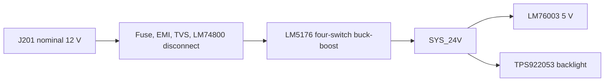

# Phase 2 preparation and engineering validation

**Project:** ESP32-P4 Displayman Development Daughterboard

**Updated:** 19 September 2026

**Controlling requirements:** `docs/PRD.md` v0.6

**Current schematic:** Phase 2 / single-source v0.4

## 1. Scope and phase boundary

This record captures engineering validation completed before and during schematic entry. REV1 now has one external high-voltage input: J201 accepts nominal-12 V vehicle power or a regulated/current-limited nominal-12 V bench supply. The PCB has not been started.

The current power path is:

The dedicated 24 V barrel input and both LM74700 branch-ORing paths are deleted. Bench and vehicle testing therefore exercise the same downstream electronics.

## 2. Requirements and implementation choices

| Topic | Mandatory behavior | Current implementation |
|---|---|---|
| External power | One nominal-12 V path; survive reverse battery and defined evaluation transients; no reverse current toward J201 | Micro-Fit input, 5 A fuse, damped filter, SM8S24CA-Q, LM74800-Q1 and common-drain CSD19531Q5A pair |
| Internal bus | Regulated 24 V-class rail for all former high-voltage consumers | LM5176-Q1 output directly named `SYS_24V`; 30 W design capacity |
| Nano/USB | USB-only and USB+12 V are legal; neither side may phantom-power the other system | LM76003 plus TPS259470A reverse-blocking eFuse and service link; retain Nano-side reverse-current test |
| Display logic | Fixed 1.8 V IOVCC, fixed 2.8 V VCI, deterministic reset and reverse shutdown | TLV75518, TLV75528/TPS22919, LM3880-1AA, TPS3808, SN74LVC1G07 clamps, 6800 µF isolated hold-up |
| Backlight | 240 mA total, default off, hardware validity gating and PWM | TPS922053DYYR at 300 kHz with 0.825 Ω effective sense and 68 µH inductor |
| Touch | No partial-power path between Nano and GT9271 domain | TLV75533 plus TMUX1574 powered-off-safe isolation of SCL/SDA/INT/RESET |
| DSI | Passive two-lane channel capable of at least approximately 1.5 Gb/s/lane | Straight-through lanes, 0201 zero-ohm provisions, TPD6E05U06, no bridge/choke/stub |

## 3. Component revalidation

The selected active devices remain current manufacturer offerings in the documented packages. Lifecycle/availability is rechecked at procurement; manufacturer data, not distributor summaries, controls substitutions.

| Function | Selected part | Validation disposition |
|---|---|---|
| Input protection | TI `LM74800QDRRRQ1` | 3–65 V operation, negative-input tolerance and external back-to-back FET control fit the protected evaluation input. Common-drain topology retained. |
| Protection FETs | TI `CSD19531Q5A` | 100 V rating and single-pulse SOA cover calculated HGATE ramp points behind the 38.9 V-class TVS; prototype VDS/current capture remains required. |
| Vehicle TVS | Bourns `SM8S24CA-Q` | Bidirectional, 24 V standoff, DO-218AB; pulse energy still depends on harness/source impedance. |
| 12→24 V converter | TI `LM5176QPWPRQ1` | Four-switch buck-boost, 4.2–55 V controller; quantitative low-line/current-limit/compensation review remains valid after bus simplification. |
| 24→5 V converter | TI `LM76003RNPR` | 3.5–60 V operating range easily covers 23.19–24.84 V `SYS_24V`; 3 A target retained. |
| Nano eFuse | TI `TPS259470ARPWR` | True reverse-current blocking toward `SYS_5V`, controlled inrush and approximately 3.2 A limit; retained unchanged. |
| Supervisor | TI `TPS3808G01DBVR` | 18.47–20.04 V bus-loss threshold with required 1 nF SENSE bypass; retained. |
| Sequencer | TI `LM3880MF-1AA/NOPB` | Exact suffix gives 10 ms nominal ordered flags and reverse shutdown; retained. |
| Logic LDOs/switch | TI `TLV75518`, `TLV75528`, `TLV75533`, `TPS22919` | Voltage, current, dropout and discharge behavior remain suitable. |
| Touch isolation | TI `TMUX1574DYYR` | Powered-off protection and bidirectional channels are safer than a permanently connected I²C translator for SCL/SDA/INT/RESET. |
| Backlight | TI `TPS922053DYYR` | 4.5–65 V buck LED driver; regulated `SYS_24V` removes the former 21.6 V external-input corner. |
| MIPI/touch ESD | TI `TPD6E05U06RVZR`, `TPD4E05U06DQAR` | Low-capacitance, flow-through protection retained. |

Removed selections are Switchcraft RAPC722X, Littelfuse 0451002.MRL, Littelfuse SMBJ30A, both LM74700-Q1 controllers, and their dedicated branch MOSFET/passive networks. They perform no remaining REV1 function.

## 4. Single-source power validation

### 4.1 Input, startup and SOA

- J201/F201/input-filter/SM8S24CA-Q/LM74800/Q201/Q202 remain unchanged.
- Polarized C203 remains on protected `VEH_PROT`; only reverse-tolerant ceramic capacitance is upstream of the disconnect.
- C203 + C309 + C310 is 342 µF nominal and 410.4 µF at +20%.
- R206/C207 = 10 kΩ/82 nF gives approximately 0.229 A nominal direct precharge and 0.464 A worst calculated corner.
- Direct SOA points remain 20 V/0.47 A/18 ms and 20 V/0.18 A/46 ms.
- With the reduced `SYS_24V` bank, fastest LM5176 output-capacitor charging is about 0.659 A; capacitor-only simultaneous startup is about 1.56 A referred to the source including direct precharge.
- The conservative 30 W full-load overlap bound remains about 2.8 A. Q202 remains inside the CSD19531Q5A single-pulse SOA used in the review.

### 4.2 LM5176 and `SYS_24V`

- Feedback 580 kΩ/20.0 kΩ with 0.788–0.812 V reference and 1% resistors yields 23.187–24.836 V static regulation range.
- Use 23.0–25.0 V as the conservative downstream steady-state design envelope.
- Converter output bank: C311 220 µF + C312/C313 22 µF each = 264 µF.
- Distributed local input bypass: LM76003 9.447 µF + backlight 10.1 µF.
- Total electrically connected `SYS_24V` capacitance: 283.547 µF nominal.
- Removed C403/C404 230 µF was a source-handover reservoir and is not required in the single-source system.
- Existing R305/C304/C305 compensation recalculates to approximately 1.05 kHz crossover, with 129 Hz zero and 39.3 kHz pole; the 28.6 kHz worst boost RHP zero still gives a 9.55 kHz one-third limit.
- No compensation component change is justified. Bode/load-step/thermal measurement remains mandatory.

### 4.3 Downstream limits

- LM76003 has more than 35 V of operating-range margin at the maximum static `SYS_24V` setpoint; calculated worst ripple is about 0.80 A p-p at 5 V/3 A.
- TPS922053 gross headroom at 23.187 V, 19.8 V LED and 0.2 V sense drop is 3.187 V. After conservative switch, diode, bead/wiring and ripple allowance, approximately 2.45 V remains.
- Worst-static TPS922053 ripple is about 192 mA p-p at 24.836 V; estimated peak is about 346 mA, far below inductor and driver fault ratings.
- TPS3808 trip remains 18.47–20.04 V. The voltage separation from minimum static `SYS_24V` to the highest trip is 3.15 V.
- At 30 W, 283.547 µF provides about 0.64 ms from 23.187 V to 20.04 V after conversion stops. TPS3808 is a hardware warning path; C601 independently powers the ordered shutdown after assertion.
- C601 remains 6800 µF. Its 4624 µF aged/tolerance minimum supplies the calculated 3.57 mC shutdown charge with about 0.77 V droop plus 0.1 V transient/ESR allowance.

### 4.4 Input-current budget

| Input | 30 W / assumed efficiency | Calculated current |
|---:|---:|---:|
| 14.4 V | 90% | 2.31 A |
| 12.0 V | 88% | 2.84 A |
| 9.0 V | 86% | 3.88 A |
| 8.0 V | 85% | 4.41 A |

A full-load bench supply should provide nominal 12 V at 5 A or more with adjustable current limiting. Full-load operation below 9 V is not required; reboot during deep crank is acceptable.

## 5. Power-state matrix

| 12 V input | Nano USB | Display command | Required result |
|---|---|---|---|
| Absent | Absent | Either | All rails off; reset asserted; backlight off. |
| Absent | Present | Either | Nano only. TPS25947 blocks `NANO_5V`→`SYS_5V`; display/touch isolated; no backlight or `SYS_24V`. |
| Present | Absent | Off | `SYS_24V`/`SYS_5V` valid; Nano feed available; display rails remain off. |
| Present | Absent | On | Normal sequenced system operation. |
| Present | Present | Off/on | Normal debug mode. TPS25947 blocks `NANO_5V`→`SYS_5V`; the Nano header-to-USB reverse path remains a controlled prototype test. |

Unexpected source loss does not hold the Nano alive for DCS commands. Hardware immediately disables the backlight and asserts reset, then removes VCI before IOVCC using stored logic energy. Commanded shutdown remains PWM=0, DCS `0x28`, DCS `0x10`, wait at least 120 ms, then hardware rail shutdown.

## 6. MIPI-DSI validation

Confirmed electrical mapping remains Nano D1/CLK/D0 N/P straight through to the corresponding panel pairs. There is no lane or polarity swap. The channel requirements remain:

- 100 Ω differential impedance;
- at least approximately 1.5 Gb/s/lane electrical capability;
- continuous reference plane and tightly coupled return paths;
- minimum transitions, no branches or test stubs, and via-pair symmetry;
- 0201 zero-ohm inline provisions near the source;
- TPD6E05U06 adjacent to the panel connector with a short low-inductance return.

Displayman confirms two lanes, RGB888, 600 × 1280 host-active timing, physical 480 × 1280 glass, 60-column-per-side masking, 55 MHz PCLK, the documented porches, continuous-clock recommendation, and approximately 46–60 Hz. Exact HS lane rate and the best ESP32-P4 setting remain firmware/prototype parameters; neither 110 nor 500 Mb/s/lane controls the PCB.

## 7. GT9271, GPIO and Nano validation

- TMUX1574 isolates Nano I²C, touch INT and touch RESET unless both logic domains are valid.
- Touch-side INT uses a 4.7 kΩ pull-up to `TOUCH_3V3`; RESET has a 100 kΩ pull-down.
- Corrected GPIO mapping is GPIO21 LCD reset command, GPIO22 touch reset, GPIO20 LCD power enable, GPIO32 touch INT, and GPIO23 backlight PWM, on P1 pins 15/16/13/23/7 respectively.
- The choices avoid GPIO7/8 onboard I²C, GPIO2–5 pad JTAG, GPIO24–27 USB Serial/JTAG and GPIO36–38 strapping/UART0 groups. GPIO33/P1-24 is the spare alternate.
- Nano DSI pins 14/15 are reference-only Nano 3.3 V inputs to the daughterboard logic and are never driven.
- The published Waveshare schematic distinguishes Type-C `USB0_5V` from header `VCC_5V` and shows onboard power-path circuitry. It does not conclusively specify reverse current for every fitted component and transition, so TPS25947 remains and the four-quadrant prototype test remains required before unrestricted-laptop use.

## 8. Connector and mechanical status

Electrical pin maps for J201, J701 DSI, J702 LCD and J801 touch remain checked. The Nano header mapping was subsequently corrected from the official Waveshare pinout chart and schematic; the complete P1/P2 baseline is in `nano-interface-floorplanning-study.md`. P2 is electrically unused and may be retained only as mechanical support. The manufacturer-file audit in `mechanical-interface-verification.md` establishes the 50 × 50 mm Nano outline, Ø2.70 mm mounting pattern, exact 2×13 header grids, principal component envelopes and selected board-side connector types. The edited/rescaled KiCad `User.1` drawing remains a visual working reference, not placement authority.

Preliminary placement now uses bottom-mounted `SSQ-113-01-G-D` sockets at 11.01 mm nominal facing-PCB separation and local USB-A/RJ45 cutouts. Physical checks remaining before mechanical freeze are Nano DSI pin-1/contact-face presentation, exact socket mating/separation and standoff matching, the Type-B pass-through mock-up, the tight RJ45 cutout margin, and delivered LCD/touch flex pin-1/stiffener/termination presentation. J701 is placed on top with its mouth toward the radiused slot. See `preliminary-placement-mechanical-baseline.md`.

The removed RAPC722X footprint/model and 24 V plug-fit action no longer apply.

## 9. Schematic implementation status

The canonical native KiCad hierarchy remains three sheets:

| Sheet | Scope |
|---|---|
| Power | J201 protection, LM74800, LM5176 to `SYS_24V`, LM76003 and TPS25947 |
| Display Power & Backlight | VIN-loss monitor, hold-up/sequencing, LCD/touch rails, reset gating and TPS922053 |
| Interfaces & Nano | Nano headers/DSI, MIPI ESD, LCD/touch connectors, powered-off-safe touch isolation and debug |

This pass intentionally did not rearrange unrelated blocks or begin PCB work. The active schematic uses normal-grid label-centric connectivity and retains `endpoint_off_grid` as an ERC error.

## 10. Remaining risks and owner actions

### Electrical/prototype validation

- vehicle transient energy and TVS/fuse/FET coordination require tests with a defined source/harness; no ISO qualification is claimed;
- LM5176 loop response, efficiency, EMI and 9 V/30 W thermal behavior require measurement;
- backlight current, headroom and thermals require a 16.8–19.8 V programmable LED-equivalent load and panel samples;
- Nano USB reverse-current behavior requires controlled measurement before connecting an unrestricted laptop;
- DSI HS rate/video-mode tuning, GT9271 reset/address behavior, and display masking require firmware/prototype validation.

### Owner physical input before PCB placement freeze

- provide or inspect the actual Nano, LCD/touch flexes, selected FFCs, stacking headers/standoffs and J201 harness;
- approve the final mechanical stack and cable directions.

No owner electrical-design decision is required before schematic review. No newly discovered electrical issue blocks the schematic. PCB placement/layout remains separately gated.

## 11. Sources

Current manufacturer documentation is indexed in `docs/references.md`. The controlling calculations are in `docs/design-notes/schematic-calculations.md`, connector/net audits are in `docs/design-notes/schematic-review.md`, and Displayman evidence remains preserved as S7–S9 in the PRD/reference history.
